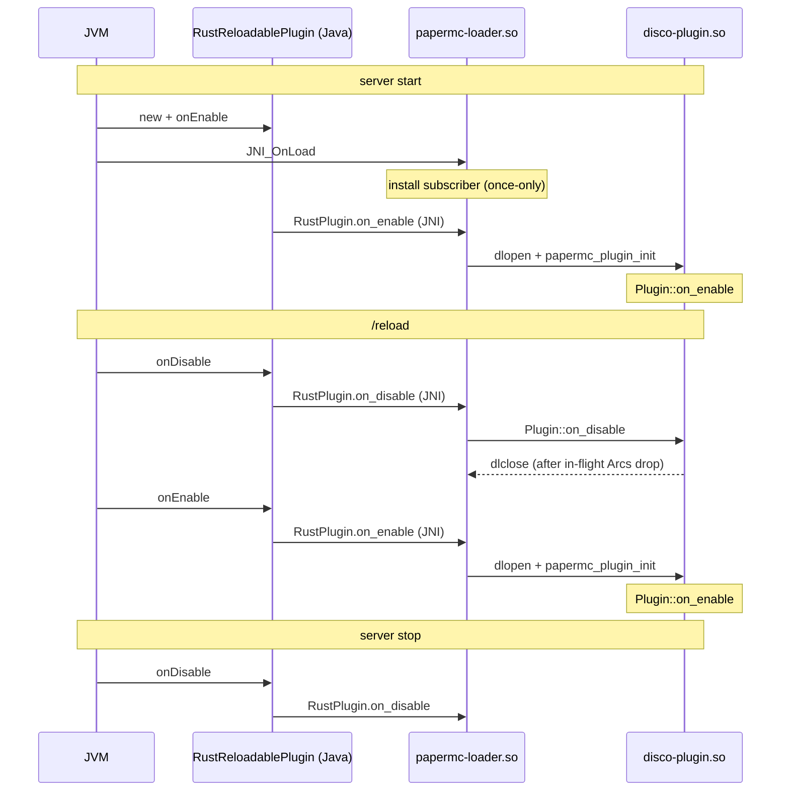
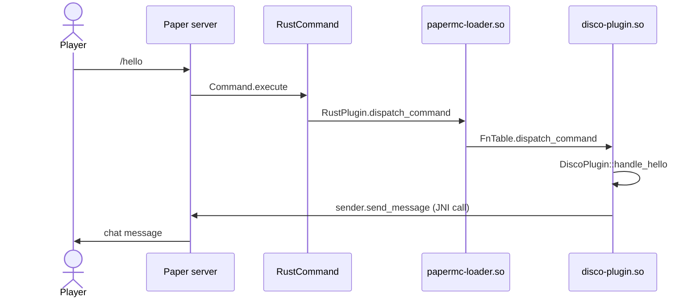

This project is a proof-of-concept Rust implementation of a Minecraft Paper server plugin built
through Java's JNI native interface. The goal is to write meaningful Rust Paper plugins with
_minimal_ Java.

# Project layout

* Makefile - main entrypoint for build. It handles the orchestration of Gradle (java) and Cargo
  (rust). Neither Gradle nor Cargo know about each other.

* papermc-loader - Provides libpapermc_loader.so, the stable native library that the
  RustReloadablePlugin loads via papermc's NativeLoader. papermc-loader.so then dlopens the plugin's
  own .so (e.g. libdisco_plugin.so), which is where the implementation details of the Rust side of
  the plugin are. We do this so that the /reload command can work, since it's not possible to reload
  a native DSO in Java?

  Ideally, papermc-loader _never_ has to change when we add new functionality to a consumer plugin.
  It's intended to be stable, so that we can run the server once, and /reload once we make
  modifications.

* papermc - both the shared Rust / Java interface library AND the Java module that consumer plugins
  depend on. The Rust crate (`Cargo.toml`, `src/lib.rs`, `src/bukkit/...`) is where the JNI
  interfaces are wrapped. The Java sources (`src/main/java/io/papermc/*.java`) provide the base
  `RustReloadablePlugin` JavaPlugin, the native-library loader, the tracing-subscriber bridge, and
  the command/event executor bridges. The Rust crate and the Java module live in one directory
  because they are two halves of a single logical component; Cargo and Gradle have non-overlapping
  file conventions and coexist.

  Eventually, this will grow to contain a Rust wrapper around the bukkit / paper Java plugin API. As
  the bukkit / paper API surface is very large, it's extremely likely that new features will require
  modifications to the papermc crate.

  Ideally, the API provided by the papermc Rust crate mirrors the bukkit / paper plugin API so that
  it's fairly natural to write Rust plugins. We'll have to consider modifications when we come up
  against language limitations, but we should strive to mirror the Java APIs as much as possible.

* disco-plugin - the PoC consumer plugin. The Rust crate (`Cargo.toml`, `src/lib.rs`) implements the
  `papermc::Plugin` trait and registers handlers via `SetupApi`. The Gradle config
  (`build.gradle.kts`) packages a Bukkit plugin jar that bundles the papermc Java module and
  declares `io.papermc.RustReloadablePlugin` as its `main:` in `src/main/resources/plugin.yml`. Like
  papermc, the Rust crate and Gradle module share a directory.

  Ideally, new features are added in the Rust side here, provided sufficient APIs are provided by
  the papermc Rust crate.

# Plugin lifecycle

The JVM can't unload a native DSO. papermc-loader is the never-unloaded stub that `dlopen`s and
`dlclose`s the plugin .so per `/reload` cycle, so iterating on Rust code only requires `/reload`,
not a server restart.

# Java <-> Rust data flow

Java -> Rust calls in the RustPlugin Java class are implemented by C function pointers stayed in
`FnTable`. Rust -> Java calls call into the JVM via the JNI environment.
